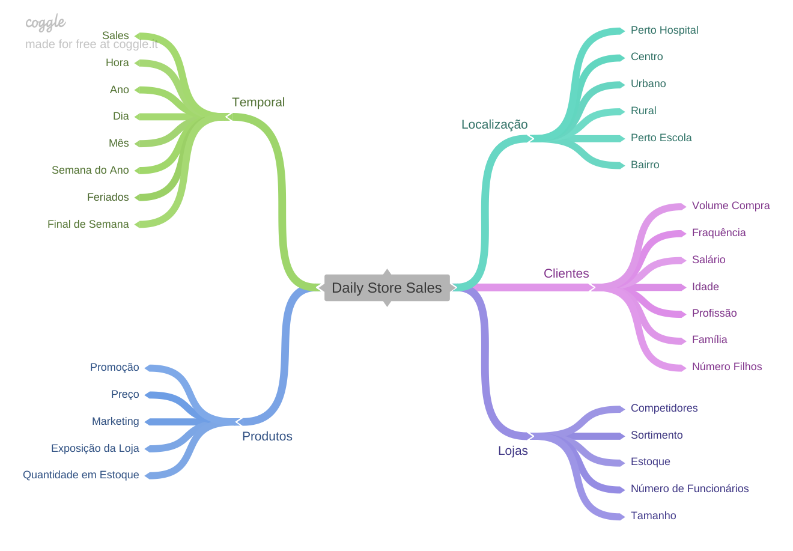
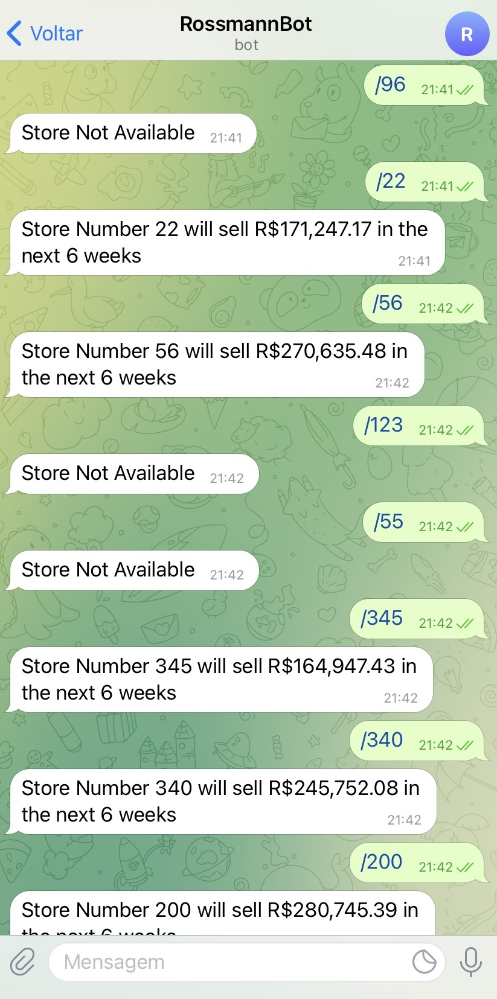

<h1 align="center">Previsão de Vendas das Lojas Rossmann</h1>

<h1 align="center">
  
</h1>

Neste projeto foi criada uma problemática hipotética sobre a Previsão de Vendas das Lojas Rossmann. A rede de lojas Rossmann possui mais de 4.000 drogarias distribuidas pela Europa, e como em qualquer outro tipo de negócio, há influência de fatores externos e internos na incrementação ou descrescimento de vendas. Podemos citar a distância dos concorrentes, períodos promocionais e feriados como exemplos de tais fatores.

<h1 align="center">Questão e Entendimento de Negócio</h1>

1.	Contexto da Problemática Hipótetica

Realizou-se uma reunião mensal para discutir os resultados de vendas das lojas, e após este primeiro momento, o CFO fez uma requisão de Previsão de Vendas das próximas seis semanas para os gerentes de cada loja. A necessidade surgiu devido a intenção de se realizar obras de reforma nas unidades, essa seria o motivo de possuir conhecimento sobre o faturamento de cada loja e o quanto pode ser investido nesse projeto sem causar impactos financeiros negativos para a Empresa. Porém, a previsão ainda é realizada de forma manual pelas lojas e, além disso, a visualização dos resultados das vendas é acessada somente pela rede de computadores das lojas.

2.	Questionamento

<ul>
<li>Qual o faturamento de cada loja no final do decorrer de seis semanas?</li>
	
<li>Como disponibilizar os dados de vendas de forma que qualquer responsável pelo projeto de reformas possa acessar e tomar decisões sobre o processeguimento das obras?</li>
</ul>

3.	Soluções

<ul>
<li>Previsão das vendas das lojas utilizando algoritmos de Machine Learning com técnicas de Time Series;</li>
	
<li>Visualização dos Resutaldos das Vendas feita de forma remota por meio de Smartphone</li>
</ul>

<h1 align="center">Desenvolvimento do Projeto</h1>

São apresentadas duas tabelas no DataSet: a Tabela "Sales", que contém dados sobre as vendas, dias da semana de funcionamento, clientes, etc e a Tabela "Store", que apresenta as informações sobre as lojas em relação à classificação, concorrentes, promoções, etc. A nossa intenção é mesclar as duas tabelas para que as mesmas se complementem.

1.	Descrição dos Dados

Uma das primeiras partes do projeto é realizada no estudo do tipo de dados que temos disponíveis para o desenvolvimento do projeto. Nessa etapa são obtidos conhecimentos sobre os dados tabelados: qual a quantidade de observações e atributos apresentados, quais os tipos de atributos, etc.

2.	Feature Engineering

Na etapa de Feature Engineering são selecionadas as melhores features para o modelo de predição, criação de novas features derivadas das originárias e transformação matemática de features para que seja utilizada ao máximo a maior quantidade de dados possíveis do dataset.

- Criação de Features:

No projeto serão utilizadas técnicas de Time Series, portanto das features já existentes foram criadas outras features temporais. Exemplos destas: período decorrido após instalação de novo concorrente, período de promoções, meses promocionais, features geradas por splitting de datas (dias, meses, anos, etc).

- Missing Values:

No caso de dados ausentes podem ser aplicados alguns métodos: excluir ou preencher os dados faltantes. Este projeto é desenvolvido em técnicas de Séries Temporais, logo, há certas restrições para a manipulação dos dados e existem técnicas específicas que podem ser utilizadas para preenchimento dos dados ausentes (Last Observation Carried Forward e Observation Carried Backward, por exemplo). Realizou-se, então, uma análise das ligações entre os dados ausentes e outras features do dataset e, assim, foram criadas hipóteses sobre a falta dos dados e como poderiam ser preenchidos. 

	
<h1 align="center">Mapa Mental de Hipóteses</h1>

O Mapa Mental pode ser utilizado como um “guia” para observar quais são as variáveis mais importantes para a Análise Exploratória dos Dados e quais serão mais relevantes para a criação das hipóteses sobre o desenvolvimento e insights que serão apresentados. Dado que o projeto tem a finalidade de predição de vendas, devemos selecionar as variáveis que serão agentes para tal objetivo e quais atributos destes são mais importantes para a validação das hipóteses.

<h1 align="center">
  
</h1>

No centro do mapa mental podemos observar o objeto de análise “Daily Store Sales”, seguido pelo primeiro patamar das ramificações apresentando as variáveis agentes que impactam as vendas das lojas e logo após, os atributos que caracterizam tais agentes. Essa análise é importante para que quando for realizada a lista sobre hipóteses que serão apresentadas pelo nosso projeto, as variáveis necessárias para validar tal sugestão estejam disponíveis.

<h1 align="center">Análise Exploratória de Dados</h1>

Após a filtragem de hipóteses serão realizadas as análises sobre as features e como estas agem sozinhas ou em combinação com outras features. O projeto teve doze hipóteses finais que foram validadas ou refutadas pelo estudo gráfico de cada uma delas (informações apresentadas no notebook). 

<h1 align="center">Feature Selection - Boruta</h1>

Concluindo-se o estudo e validação das hipóteses, é possível indicar quais features terão maior ou menor relevância no "target" vendas durante as próximas seis semanas. Agregando percepção a essas validações, utilizamos o método do Boruta, que tem a finalidade de realizar uma predição sobre quais features serão mais importantes durante o desenvolvimento do modelo. O resultado da análise do Boruta não foi utilizado para excluir as features anteriormente análisadas, mas sim como complemento de informações para corroborar ou nos dar uma nova visão sobre análises das variáveis que já haviam sido escolhidas ou não. 

<h1 align="center">Machine Learning Modelling</h1>

Para a escolha da técnica de Machine Learning que seria utilizada para o desenvolvimento dos modelos foram testados e coletados resultados de erros das seguintes técnicas:

o	Average Model;

o	Linear Regression Model;

o	Lasso;

o	Random Forest;

o	XGBoost.

Os resultados de erros (MSE, MAPE e RMSE) de cada técnica foram concentrados de forma tabulada e comparados, após a cross-validação foi escolhida a técnica que seria utilizada para ajustes de hiperparâmetro e aplicação.

<h1 align="center">Obtenção dos resultados de forma remota</h1>

A última parte do projeto foi o desenvolvimento de API e App/Bot para a visualização do resultado individual da predição das lojas por meio de aplicativo de comunicação disponível e de fácil acesso em um smartphone. 

  

<h1 align="center">Referências</h1>
https://www.kaggle.com/c/rossmann-store-sales    - Acesso em: 03/11/2021
